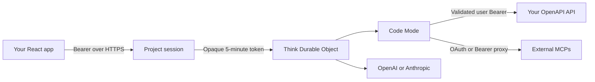

<p align="center"></p>

# Lemy

Give your web app an agent. Lemy turns an OpenAPI API and optional external MCP servers into a secure, stateful Cloudflare Think agent with a small React client.



Each project chooses its API, model, CORS origins, mutation policy, skills, and external MCPs. Each authenticated end user and thread gets a separate Durable Object conversation. Think stores the conversation in SQLite; D1 stores the control plane. PostgreSQL, LangGraph, CopilotKit, containers, and an AG-UI bridge are not part of the runtime.

## What you need

- Node.js 22+
- a Cloudflare account for deployment
- an OpenAI or Anthropic API key
- an API with a reachable OpenAPI 3.x document
- a mandatory bearer-validation endpoint

## Run locally

```bash
npm ci
cp apps/cloud/.dev.vars.example apps/cloud/.dev.vars
npm run dev --workspace @lemy/cloud
```

Open [http://localhost:3001](http://localhost:3001), activate OpenAI or Anthropic with an API key, then create a project. Local mode signs in as `local@lemy.dev`, uses local D1 and Durable Objects, and disables rate limits. Provider keys follow the same validation and encrypted-storage path used in production.

Create a project with:

- the OpenAPI document URL;
- an optional API base URL override;
- the mandatory bearer-validation URL;
- the exact React origins allowed to create runtime sessions;
- a model and mutation policy.

Loopback HTTP API URLs are accepted only while `LOCAL_DEV_MODE=true`.

## Test and inspect a project

Open **Test & activity** from a project to run the real agent before integrating a client. Enter a customer bearer, choose **Ask before tools** or **Approve tools automatically**, and send a prompt. Lemy validates and forwards the bearer through the same path as a production runtime session, using a fresh thread for each playground run.

The activity panel shows the latest 30 runs with their source, status, model, input/output token count, tool-call count, timestamp, and a safe error summary. D1 retains the latest 100 records per project. Prompts, responses, and bearer values are not copied into activity records.

## Add Lemy to React

```bash
npm install @xameyz/lemy-react @cloudflare/think agents ai
```

Copy the project runtime URL from the dashboard and pass the current user's API bearer:

```tsx
import { OpenApiAgentSidebar } from "@xameyz/lemy-react";
import "@xameyz/lemy-react/styles.css";

export function Assistant({ bearer }: { bearer: string }) {
  return (
    <OpenApiAgentSidebar
      bearerToken={bearer}
      runtimeUrl="https://lemy.example.com/runtime/YOUR_PROJECT_ID"
    />
  );
}
```

The bearer is sent only to `POST /runtime/:projectId/session`. Lemy validates it, encrypts it into a short-lived opaque session token, and connects the browser to the project Think agent. The same bearer is decrypted only when the agent calls the customer's OpenAPI API.

`toolApprovalMode="mutations"` is the default. Mutating API operations and external MCP tools pause durably for **Approve once**, **Always allow**, or **Reject**. Use `"auto"` to never ask or `"always"` to approve every tool call individually. Persist remembered tools per user and project.

Use `OpenApiAgentProvider` and `useLemyChat()` for a custom interface. The client speaks the native Cloudflare Agents/Think protocol; it does not advertise generic AG-UI compatibility.

React and React Native clients support MCP-backed calls, HITL policies, durable
threads, and stopping active responses. React Native apps use the headless
`@xameyz/lemy-react-native` package with the same runtime URL and bearer.

## Bearer validation contract

Lemy sends `GET` with the user's `Authorization` header. The endpoint must return `200` JSON with a stable `sub`:

```json
{
  "sub": "user_123",
  "tenant": "workspace_123",
  "active": true,
  "exp": 1784300000
}
```

- `sub` is required.
- `tenant` is optional and should identify the API tenant or workspace.
- `active: false`, an expired `exp`, `401`, or `403` rejects the session.
- The response is capped at 16 KiB and must complete within five seconds.

Lemy hashes `tenant + sub` into the principal scope. Token rotation therefore keeps the same thread identity without storing the bearer as identity. Your API remains responsible for authorization on every operation.

## Models and provider keys

Model providers belong to the authenticated workspace, not to an individual project or the Lemy deployment. From the dashboard, activate OpenAI, Anthropic, or both. Lemy validates each key against the provider's Models API before saving it, encrypts it with `PROJECT_SECRETS_KEY`, and never returns it to the browser. You can refresh validation or replace a key without editing every project.

Projects can only select models from currently validated providers. If a refresh shows that a key was rejected, new runtime sessions stop until the provider is restored. An invalid replacement never overwrites the previously saved key.

The built-in catalog follows the current OpenAI GPT-5.6 and Anthropic Claude families. A self-hosted operator can replace the choices without owning the keys:

```dotenv
LEMY_MODEL_CATALOG_JSON=[{"provider":"openai","model":"gpt-5.6-luna","label":"GPT-5.6 Luna"}]
```

## External MCPs

Add Streamable HTTP MCP servers from a project's **Manage MCPs** screen. A connection can use:

- OAuth 2.1 with discovery, PKCE, refresh, and encrypted tokens; or
- a bearer token encrypted at rest.

Think receives Code Mode connectors, never the stored MCP credential. Requests go through a bounded, rate-limited project proxy. In approval mode, every external MCP tool pauses unless that exact connector tool is remembered.

## Skills

Projects accept up to 16 standard `SKILL.md` instruction files. Lemy stores their name, description, and Markdown body and exposes them as native refreshable Think skill sources. Updated skills apply to existing conversations after the project refreshes.

```markdown
---
name: task-triage
description: Use when reviewing or prioritizing tasks.
---

Check overdue tasks first, then group open tasks by priority.
```

Skills do not bypass API authorization, read-only policy, or human approval.

## Deploy your own instance

1. Authenticate and create D1:

   ```bash
   cd apps/cloud
   npx wrangler login
   npx wrangler d1 create lemy-cloud
   ```

2. Put the returned database ID in `apps/cloud/wrangler.jsonc`.

3. Configure secrets. Generate `PROJECT_SECRETS_KEY` with `openssl rand -base64 32`.

   ```bash
   npx wrangler secret put BETTER_AUTH_SECRET
   npx wrangler secret put PROJECT_SECRETS_KEY
   npx wrangler secret put ADMIN_LOGIN
   npx wrangler secret put ADMIN_PASSWORD
   npx wrangler secret put GITHUB_CLIENT_SECRET
   npx wrangler secret put GOOGLE_CLIENT_SECRET

   # Optional approval emails
   npx wrangler secret put RESEND_API_KEY
   npx wrangler secret put ACCESS_APPROVAL_EMAIL_FROM
   ```

4. Configure `BETTER_AUTH_URL`, `PUBLIC_APP_URL`, the GitHub/Google OAuth client IDs, and `ACCESS_REQUEST_ORIGINS` with the landing-page origin. Use a verified Resend sender for `ACCESS_APPROVAL_EMAIL_FROM`. Set the GitHub repository variable `LEMY_CLOUD_URL` to the deployed Worker origin so the Pages landing build can submit requests.

5. Deploy:

   ```bash
   npm run deploy
   ```

The deploy script builds the dashboard, applies D1 migrations, and deploys the Worker, Think Durable Object, Code Mode runtime, assets, Worker Loader, and rate-limit bindings. Visitors request access from the landing page, limited to three submissions per IP per minute. The private `/admin` backoffice accepts or revokes the requested email; only a Google or GitHub account returning that exact, verified email can then use Cloud. When Resend is configured, approval sends the Cloud sign-in link. An email failure does not undo access, and the backoffice reports whether delivery succeeded. Serve it over HTTPS because browser Basic authentication sends the admin credentials with each backoffice request. Approved users activate their own model providers, so the deployment itself does not need provider keys.

## Required Worker configuration

| Variable | Required | Purpose |
| --- | --- | --- |
| `BETTER_AUTH_SECRET` | yes | Control-plane session signing secret |
| `BETTER_AUTH_URL` | yes | Public auth base URL |
| `PUBLIC_APP_URL` | yes | Dashboard, OAuth callback, and internal MCP proxy origin |
| `PROJECT_SECRETS_KEY` | yes | Base64-encoded 32-byte AES key for runtime, provider, and MCP credentials |
| `GITHUB_CLIENT_ID` / `GITHUB_CLIENT_SECRET` | yes* | GitHub sign-in credentials |
| `GOOGLE_CLIENT_ID` / `GOOGLE_CLIENT_SECRET` | yes* | Google sign-in credentials |
| `ACCESS_REQUEST_ORIGINS` | yes | Comma-separated landing origins allowed to request access |
| `ADMIN_LOGIN` / `ADMIN_PASSWORD` | yes | Credentials for the private `/admin` access backoffice |
| `RESEND_API_KEY` / `ACCESS_APPROVAL_EMAIL_FROM` | optional | Email accepted users a Cloud sign-in link |
| `LEMY_MODEL_CATALOG_JSON` | optional | Model choices for the supported OpenAI and Anthropic providers |
| `MAX_DYNAMIC_WORKERS_PER_MONTH` | optional | Hard monthly Code Mode execution cap; defaults to 5,000 |
| `LOCAL_DEV_MODE` | local only | Loopback sign-in and URL allowance |
| `RATE_LIMITS_DISABLED` | tests/local only | Never set in production |

*The current app initializes both social providers. Local mode accepts placeholder values.

The D1, Durable Object, Worker Loader, assets, and rate-limit bindings live in `apps/cloud/wrangler.jsonc`.

## Programmatic control

Each project's **Agent access** drawer creates up to 10 revocable tokens for:

```text
https://YOUR_LEMY_ORIGIN/control/mcp
Authorization: Bearer lemy_agent_...
```

The secret is shown once. A **read** token can inspect that project and its external MCPs; the scoped API also exposes recent activity. A **write** token can additionally update, restart, or delete the project and manage its external MCPs. Both permissions are enforced by the API as well as the MCP tool list.

Tokens cannot access provider credentials, another project, the dashboard playground, or an end-user runtime. Real chat access always starts with the project's customer bearer-validation flow. Migration `0016_project_operations.sql` replaces legacy workspace-wide tokens, so existing tokens must be recreated from the relevant project.

## Repository

- `apps/cloud` — dashboard, API, provider configuration, Think agent, D1, and Durable Object runtime.
- `packages/react` — native Think React provider and ready-made sidebar.
- `services/codemode` — shared OpenAPI loading and request-policy code used by the Think connector.
- `examples/request-cycle-demo` — animated architecture demo; run `npm run dev --workspace @lemy/request-cycle-demo`.
- `landing` — public project page.

## Security boundaries

- Runtime sessions are project-, principal-, and thread-bound, encrypted, and expire after five minutes.
- CORS origins are exact per project; WebSocket upgrades re-check `Origin`.
- OpenAPI, validation, and MCP URLs reject private networks outside explicit local development.
- API and MCP requests have redirect, timeout, request-size, and response-size limits.
- Control-plane mutations, runtime sessions, turns, and proxied tools are rate-limited separately.
- Each workspace is capped at 500 Code Mode executions per month; the deployment also keeps a private 5,000-execution ceiling.
- Worker invocations are capped at 100 ms CPU and 150 subrequests.
- Failed admin credentials are limited to three attempts per IP every five minutes.
- Conversation count is capped per project and principal.
- Conversations are capped at 100 messages and inactive runtime data is removed after 30 days.
- Runtime sessions are capped at 10 per project and 3 per principal for their five-minute lifetime.
- Provider keys are owner-scoped, validated before storage, encrypted with AES-GCM, and never returned by the API.
- Project deletion purges every registered Durable Object conversation before deleting metadata.

## License

Lemy-authored code is source-available under PolyForm Shield 1.0.0. Internal and noncompeting commercial use is allowed; building a competing Lemy product is not. Third-party dependencies retain their own licenses. See [LICENCE.md](LICENCE.md).
